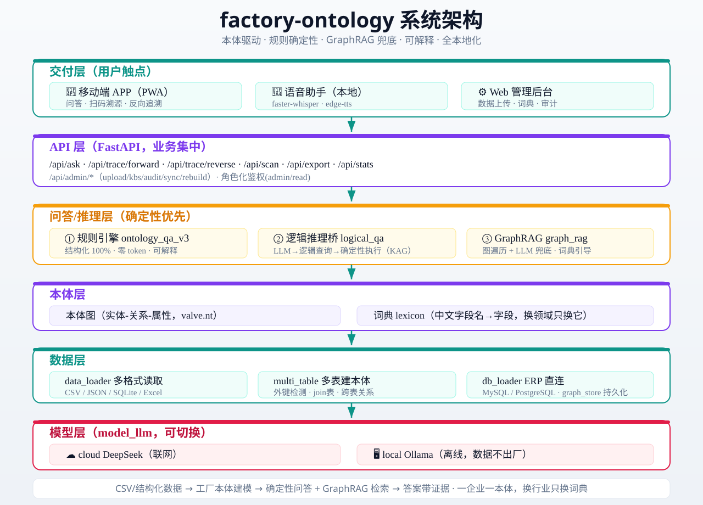
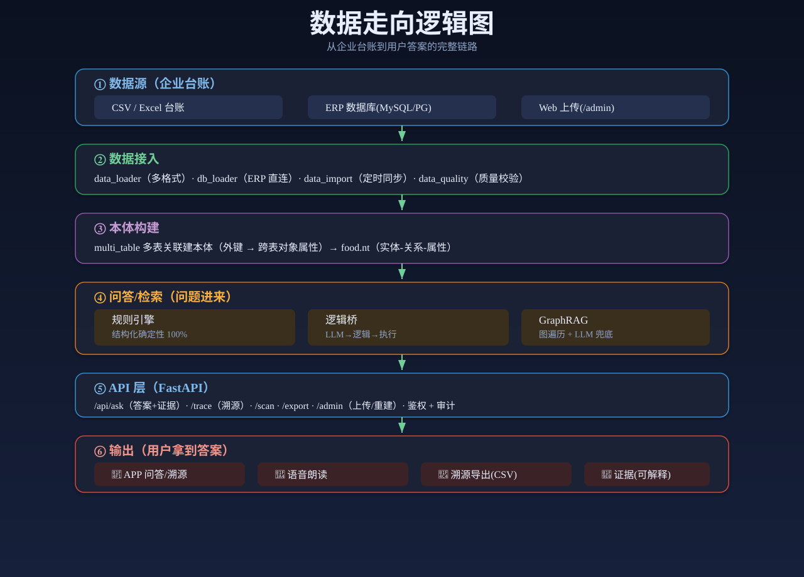

# factory-ontology

> ⭐ **觉得有用就给我们一个 Star** —— 开源维护靠社区支持，你的 Star 让这个项目被更多人看见。
> [](https://github.com/zhengjinjun1975/factory-ontology)

工厂本体驱动的数据问答框架。把结构化台账变成可自然语言提问的语义知识图谱，CSV 进，答案出，每个答案都带证据。

[](CHANGELOG.md)
[](LICENSE)
[](https://www.python.org/)
[](https://github.com/zhengjinjun1975/factory-ontology/actions)

大模型很聪明，但它不认识你的数据表。把台账直接丢给 LLM，它编起数字来理直气壮。这个仓库的做法很朴素：先让数据自己说话，再让模型在数据划定的圈子里回答。本体就是这个圈子。

> **原子化定位**：本仓库是**本体认知原子**底座（schema 驱动建模 + 规则问答 + 本体约束），并组合提供 **rag 原子**（本体引导 GraphRAG + 向量混合检索）与 **事件原子**（数据变更事件），共同构成一套可复用、可组合、可被闭源侧编排的**开源算法原子层**。换工厂只换「域」（数据/词典/schema），原子代码不动。

## 工厂本体是什么

工厂本体，是把一家工厂的数据结构（MES/ERP/台账）翻译成机器能读懂的领域知识图谱：一张表是什么实体（设备/产品/原料/批次）、字段是它的什么属性（编号/数值/状态/类型）、表之间怎么关联（生产/消耗/交付）。建好本体，业务人员就能用自然语言问数据，系统在本体划定的范围内确定性回答，并给出依据。

核心路径一句话：**CSV/结构化数据 → 工厂本体建模（schema 驱动）→ 自然语言问答 + 溯源 + GraphRAG 检索**。

**一企业、一行业、一数据**：每个企业绑定一份独立本体，用其所在行业的数据建模，数据与知识在工厂本地完成流转。换一个工厂，换一份 schema 和词典，代码不动。

## 它解决什么问题

工厂现场三个真实场景：

| 场景 | 现状 | 代价 |
|------|------|------|
| 数据看不懂 | MES/SCADA/台账数据躺在系统里，业务和运维人员不会 SQL | 决策靠老师傅拍脑袋 |
| 信息难找 | 查“哪台设备要维护”要翻系统、等 IT 排期 | 响应慢，活等人 |
| 知识断层 | 老师傅退休带走经验，新人对着字段名猜含义 | 经验流失 |

这个框架把结构化数据变成可自然语言提问的问答系统。业务人员问“报警的空压机有几台”，系统回答，并给出依据。回答不靠模型猜，靠本体里的确定性计算。

## 面对中小企业：为什么这么设计

这套方案锚定一个具体人群：**没有专职数据团队的中小工厂**。他们的现实约束决定了技术选型。

- **没有 IT 排期**：不能等两周让 IT 搭数据仓库，要当天能用。所以零依赖、一条命令启动、不引第三方框架。
- **数据在本地**：生产台账、设备数据不能上云，要留在本地。所以核心路径纯标准库，可完全离线，Ollama 本地模型即可。
- **要能复现**：决策要能追责，“为什么是这个数”要答得上来。所以规则引擎确定性优先，答案带证据，不靠 LLM 猜。
- **换行业要快**：今天做阀门，明天做化工，不能重写系统。所以词典、schema、字段映射全外置，换领域只换配置。

这不是通用 AI 平台，是一个能落到单台笔记本、带进厂区的确定性问答内核。

## 思路：本体是受限的 schema

核心路径一句话：**CSV/结构化数据 → 本体建模（schema 驱动）→ 自然语言问答 + 溯源 + GraphRAG 检索**。

本体在这里不是 W3C 的完整 OWL 推理体系，而是一份轻量 JSON schema。它声明三类东西：实体（有哪些表、哪些类）、关系（表与表怎么关联）、属性角色（哪个字段是编号、哪个是数值、哪个是分类）。schema 驱动建模把多张表统一成一张“实体-关系-属性”图，输出标准 N-Triples，下游的规则引擎和 GraphRAG 消费同一份产物。

轻，所以快。换一个工厂，换一份 schema 和词典，代码不动。

**诚实定位**：适用场景是中小工厂、台账级结构化数据（单表或多表 CSV）。不是通用 AI 平台，不是大规模图数据库方案，不处理非结构化文本。本体是受限 schema，回答能力限定在结构化查询模板之内。能力边界写在第[诚实边界](#诚实边界)节。

## 与主流路线的区别

| 路线 | 做法 | 短板 |
|------|------|------|
| Text-to-SQL | 让 LLM 直接生成 SQL | 公开基准上 Spider 87%、BIRD 63%，再往上靠针对具体库适配。表结构一变就要重来，还要防它生成写库语句 |
| 向量 RAG | 语义相似度检索 + LLM 生成 | 答案流畅，但来源不可控，幻觉难根除。追问“为什么是这个数”，答不上来 |
| 本体规则引擎 | 本体约束 + 确定性计算 + 证据溯源 | 查询被限定在结构化模板内，开放式问题仍需 LLM 兜底 |

本方案取第三条路。本体把表变成受限 schema，规则引擎在 schema 内确定性回答：数量、极值、平均、过滤、范围、计数。答案精确、可复现、零 token。规则覆盖不到的开放式问题，降级到本体引导的 GraphRAG 和 LLM。代价明确：不写 SQL 换来的确定性，边界就是模板本身。

## 检索：确定性优先的降级链

这套系统不是单一检索，是一条**确定性优先的降级链**：

```
规则引擎（确定性，零 token）
  → 逻辑推理桥（LLM 转逻辑查询后确定性执行）
  → 本体引导 GraphRAG（沿关系路径扩种子，子图检索 + LLM）
  → 向量混合检索（BM25 稀疏 + 本地向量语义，RRF 融合）
  → LLM 兜底（咨询/建议类问题，诚实声明不编数据）
```

- **规则引擎**（`ontology_qa_v3.py`）兜住结构化查询：数量/极值/平均/过滤/范围/计数，确定性、可复现、零 token。
- **逻辑推理桥**（`logical_qa.py`）把“有多少种球阀”这类需多步推理的问题，LLM 转成逻辑查询后交给确定性执行器。
- **本体引导 GraphRAG**（`graph_rag.py`）在规则 miss 后，沿本体关系路径扩展种子，子图检索 + LLM 生成，回答带实体关联依据。
- **向量混合检索**（`bm25_retrieval.py` + `vector_retrieval.py`）用 RRF 融合 BM25 稀疏命中和本地向量语义命中，覆盖“最贵的产品”“油轮有几艘”这类语义模糊查询。embedding 失败时回落到 BM25，不阻塞。
- **LLM 兜底**区分两类：数据缺失的极值查询（如实说“知识库无该数据”不编数字）、咨询建议类问题（给专业建议，声明无唯一答案）。

**本体与 RAG 的融合**不是"先检索后问答"两张皮，而是本体约束整个检索过程：本体限定可查的实体与属性（回答不越过 schema 圈定的范围），规则引擎给确定性结果，GraphRAG 沿本体关系路径扩展证据，混合检索做语义召回，最后证据溯源把答案钉回源数据。三层各自兜底，共同形成一条从确定到模糊、从规则到生成的完整链。

## 快速开始

```bash
cd codes

# 1. 用公开示例数据集建模（UCI AI4I 预测性维护数据集，1 万行真实制造传感器数据）
python run.py setup data/ai4i.csv ai4i

# 2. 自检全流程
python run.py test

# 3. 自然语言问答（ai4i 实测输出）
python run.py ask "有多少台机器"            # 一共有 10000 条记录
python run.py ask "空气温度最高的机器"       # 最大空气温度的记录: ...
python run.py ask "刀具磨损最大的机器"       # 最大刀具磨损的记录: ...
```

### 换你自己的数据

三步，不写代码：

```bash
# 1. 单表：CSV → 本体
python csv_to_owl.py 你的数据.csv output/你的数据.nt

# 2. 自动建模（本体 + 词典 + 验证）
python run.py setup 你的数据.csv 表名

# 3. 直接问：规则引擎（ontology_qa_v3）回答
python run.py ask "你的问题"
```

多表场景走 schema 驱动统一建模：

```bash
# 多表数据目录 + ontology_schema.json → 统一本体
python run.py setup-schema data_valve config/ontology_schema.json valve
```

没有手写 schema 时，`suggest_schema`（schema_ontology.py 内函数）从数据自动推断实体、关系和约束，无 schema 也能建模。

### 多数据源

`data_loader.load_table` 统一读取 CSV / JSON / SQLite / Excel，`run.py setup` 直接吃任意格式：

```bash
python run.py setup data/your.csv 表名      # CSV
python run.py setup data/your.json 表名     # JSON
python run.py setup data/your.db 表名       # SQLite（取第一个表）
python run.py setup data/your.xlsx 表名     # Excel（需 pip install openpyxl）
```

CSV / JSON / SQLite 用标准库实现，零第三方依赖。

### 厂区数据库对接

`db_loader.py` 直连厂区 ERP/数据库读表建模（MySQL / PostgreSQL），配置连接信息即可：

```bash
python run.py setup 数据库配置.json 表名   # 或用代码直连 load_db
```

```python
from db_loader import load_db
rows = load_db({"db_type": "mysql", "host": "127.0.0.1", "port": 3306,
                "user": "root", "password": "***", "database": "mes", "table": "equipment"})
```

前端「数据库接入」面板可配 MySQL/PostgreSQL 连接后一键建模。MySQL 需 `pip install pymysql`，PostgreSQL 需 `pip install psycopg2-binary`，均为可选依赖。

## 公共工业本体词典

跨行业通用的工业概念词典，让"换工厂不用重造词典"成为现实。

**内容定位**：放跨行业稳定的**领域骨架**（设备大类/故障知识/材质同义词/通用状态），不放易变的**工厂实例**（具体型号/批次/企业字段）——后者属于 per-KB 词典。

**合并机制**：问答时 `ontology_qa_v3.load_dict` 自动把 公共词典 ∪ KB词典 合并：KB 覆盖公共（工厂特殊定义优先），公共兜底 KB（KB 没有时用公共层）。一个文件、一次合并，不增加问答复杂度。

```
codes/industrial_dict/          ← 公共层（开源算法资产，纯领域知识）
├── device_types.json           设备类型 + 状态 + 同义词 + 故障 + 材质
└── (未来: fault_knowledge / process_standards / safety_compliance)
codes/industrial_dict_loader.py  ← 合并加载器（load_dict 自动调用）
```

**当前侧重**：阀门 / 精细化工 / 地球物理三大方向，泛化自 29 个行业 KB 真实数据。
**扩展**：新增维度 = 在 `industrial_dict/` 加 JSON 文件，loader 自动合并。

### ⚖️ 开源边界（公共词典策略）

**开源仓库中的公共词典（00 基础 / 01 泵阀 / 02 化工 / 03 地质）仅为示例**，说明公共词典的机制与结构。**公共工业词典集后续不再开源**。

- **开源侧**：只维护**代码 + 机制 + 简单方法论**（loader / 吸收 / 导出机制、README、架构文档）。词典内容**不参与迭代、不再新增推送**。
- **服务侧**：真正的行业词典是服务企业过程中**沉淀的认知资产**，随服务持续增长（`/api/industry/absorb` 吸收企业词典 → `/api/industry/export` 导出积累）。服务侧词典**保留在服务方本地**，不推回开源。
- **数据不出厂**：服务侧沉淀的词典（含企业痕迹，且示例多为合成数据）**不开源**，守"数据不出厂"红线。
- 开源仓库的 00-03 词典作为**可复制的机制示例**保留，新增行业词典在服务侧积累，不进入开源。

## 核心概念
| 概念 | 说明 |
|------|------|
| **本体认知原子（底座）** | `core/base_agent.py`（原子智能体统一接口）+ `agents/query_agent.py` + `schema_ontology.py`（schema 驱动建模）+ `ontology_qa_v3.py`（确定性规则问答）。认知原子是整套能力的确定性底座，被 rag/事件等原子向上组合 |
| **rag 原子** | `knowledge/`（ingest/embed/store/rag）+ `graph_rag.py` + `bm25_retrieval.py` + `vector_retrieval.py`：本体引导 GraphRAG + 向量混合检索，覆盖开放式/关系/模糊问题 |
| **事件原子** | `event_bus.py`：数据变更的领域事件模型 + 订阅/发布（DATA_ADDED / METRIC_ANOMALY / THRESHOLD_EXCEEDED / TICKET_CREATED），供闭源侧监听响应 |
| **schema 驱动建模** | `schema_ontology.py`：schema 显式声明实体/关系/约束；属性语义角色（identifier/reference/measure/category/timestamp）；类型体系（Enterprise → BusinessObject → 域类 → 实体）；validate 约束校验；traverse 跨域图遍历；build_graph 跨表统一实例图；to_nt 输出标准 N-Triples |
| **词典驱动** | 字段中文名、枚举值、状态词全部外置在 lexicon JSON。问答逻辑不绑定具体词表，换领域只换词典 |
| **建库自动映射** | `_build_lexicon` 自动生成 entity_cn2en（实体计数映射）+ numeric_fields（极值字段）+ type_cn2en + synonym_map（同义词）。换任何行业建库即生成查询映射，无需硬编码 |
| **规则引擎** | `ontology_qa_v3.py`：数量/极值/平均/总和/范围/过滤计数/反查/分组/列出/TopN 等通用模板，确定性执行，零 token |
| **逻辑推理桥** | `logical_qa.py`：LLM 转逻辑查询 → 确定性执行器，覆盖多步推理的开放式问题而不失确定性 |
| **本体引导 GraphRAG** | `graph_rag.py`：规则 miss 后，问题匹配本体关系时沿关系路径扩展种子（find_seeds），子图检索 + LLM 生成 |
| **向量混合检索** | `bm25_retrieval.py`（BM25 稀疏）+ `vector_retrieval.py`（本地向量 nomic-embed-text）RRF 融合，语义模糊查询命中，embedding 失败回落不阻塞 |
| **检索容错** | 材质/单位/类型同义词扩展。问"不锈钢"能命中 CF8/CF8M/304/1Cr18Ni9Ti 等牌号 |
| **证据溯源** | `/api/ask` 返回 evidence：命中实体、属性、数值，前端逐条展示"为什么是这个答案" |
| **模型配置** | `model_config.json`：云端 DeepSeek + 本地 Ollama + 向量模型统一配置，api_key 脱敏，可增删改/设 active |
| **原子化组装** | 认知/rag/事件等原子通过统一接口与 REST 端点向外暴露，可被闭源侧编排器按需组合调度 |

## 架构

```
data_loader → schema_ontology（schema 驱动统一建模 + suggest_schema 自动推断）[本体认知原子底座]
            → ontology_qa_v3（规则引擎，确定性优先）
            + logical_qa（逻辑推理桥）
            + graph_rag（本体引导 GraphRAG 兜底）
            + bm25_retrieval + vector_retrieval（向量混合检索兜底）[rag 原子]
            + event_bus（数据变更事件）[事件原子]
            → api_server（REST API）+ web（Svelte5 前端）
```

分层：交付层（Web/APP/语音/管理后台）→ API 层（FastAPI，原子对外暴露的编排入口）→ 原子层（本体认知原子：建模 + 确定性规则问答；rag 原子：GraphRAG + 混合检索；事件原子：数据事件模型）→ 本体层（本体图 + 词典外置）→ 数据层（多格式）→ 模型层（云端 DeepSeek / 本地 Ollama 可切换）。

**原子化边界**：本仓库是开源算法原子层，认知/rag/事件原子通过 REST 端点向外暴露，可被闭源侧编排器按需组合调度；数据全在工厂本地流转，不出厂。

### 核心组件

| 模块 | 作用 |
|------|------|
| `core/base_agent.py` + `agents/` | **本体认知原子底座**：原子智能体统一接口 + 问答/词典/评测原子（query/lexicon/eval_agent） |
| `data_loader.py` | 统一读取 CSV/JSON/SQLite/Excel |
| `schema_ontology.py` | schema 驱动统一建模：属性语义角色、类型体系、validate/traverse/build_graph、suggest_schema 自动推断、to_nt |
| `ontology_qa_v3.py` | 规则问答引擎（词典驱动，确定性，零 token） |
| `logical_qa.py` | 逻辑推理桥：LLM 转逻辑查询后确定性执行 |
| `knowledge/`（ingest/embed/store/rag）| **rag 原子**：文档切块、embedding、入库、检索 |
| `graph_rag.py` | 本体引导 GraphRAG：建图、同义词扩展、种子定位、子图检索、LLM 生成 |
| `bm25_retrieval.py` / `vector_retrieval.py` | 向量混合检索：BM25 稀疏 + 本地向量语义，RRF 融合 |
| `event_bus.py` | **事件原子**：数据变更领域事件模型 + 订阅/发布，供闭源侧监听响应 |
| `api_server.py` | REST API：问答、正/反向溯源、扫码、统计、管理、知识库/评测/资产契约端点 |
| `web/` | Svelte5 前端：CSV 上传 → 建模 → 问答 → 证据溯源 → 知识图谱/分析看板 |

周边能力（2.x 时代沉淀，保留可用）：`csv_to_owl.py`/`multi_table.py`（无 schema 的单表/多表建本体兼容路径）、`evidence.py`（证据提取）、`graph_store.py`（SQLite 图持久化）、`mcp_server.py`（MCP server，AI agent 可调用）、`voice_assistant.py`（语音助手）、`data_import.py`/`data_quality.py`/`monitor.py`（数据接入/质量校验/看门狗）、`new_kb.py`（新知识库骨架）、`agents/lexicon_agent.py`（自动词典生成）、`config/`（模型配置 + 词典 + schema + 多租户注册表）。

### 生态插件（第三方扩展）

不改主程序，第三方即可通过「插件」为系统新增能力。插件 = 一个目录（`manifest.json` + 入口模块），按 `load → register → run → unload` 生命周期被调度；扩展点注册表统一管理四类能力：`decision`（决策规则）/ `data_source`（数据源）/ `push`（推送通道）/ `template`（模板渲染）。核心框架纯标准库零依赖，可完全离线。

```bash
cd codes
python run.py plugin list                       # 列出插件（可加类型过滤）
python run.py plugin run example_decision '{"records":[{"device_id":"D001","air_temperature":302,"tool_wear":205,"rotational_speed":980}]}'
python run.py plugin ext decision maintenance_priority '{"records":[...]}'   # 调已登记扩展点
python run.py plugin install /path/to/my_plugin[.zip] [--name 别名] [--force] # 安装
python run.py plugin remove my_plugin           # 移除
```

内置示例插件 `codes/plugins/example_decision/`：按温度/磨损/转速阈值输出设备维护优先级。第三方开发指南见 `docs/插件框架.md`。

### 架构图




## 示例

### UCI AI4I 预测性维护（公开数据集）

1 万行真实制造设备传感器数据，14 列。自动建模时间约 2 分钟，12 个属性中文名自动生成。覆盖数量/极值/范围/统计/组合/过滤计数全类型提问，benchmark 61/61 = 100%。

### 阀门厂（合成示例数据）

`data_valve/` 为虚构数据，但字段特征取自真实行业标准：GB/T 32808 阀门型号编码（Z41H-16C、Q641F-40P）、材料牌号（WCB/CF8/CF8M/304）、API 598 试压矩阵（壳体/密封压力、保压、泄漏率气泡/min）、设备传感器（振动/温度/电流）。用于演示“换领域即用”和检索容错。多表 schema 建模实测：8 张表 → 1066 行 N-Triples（142 节点 / 173 边）。

```bash
cd codes
python valve_demo.py
```

实测输出（v0.2.1，规则部分确定性可复现）：

```
规则问答:  一共有多少个阀门 → 一共有 8 条记录
          价格最贵的阀门 → 最大价格的记录: 对夹蝶阀 D371X-10（价格=2560.0）
逻辑桥:    有多少种球阀 → 符合条件的有 2 条
反向溯源:  不合格原料 R007螺栓 → 受影响批次 → 产品（召回场景成立）
benchmark: 9/9 = 100%
```

同义词容错实测：问“不锈钢”，检索命中 CF8 产品 P004/P003 及多批含 304/CF8 牌号的原材料。

### 食品溯源（合成示例数据）

`data/food_*.csv` 为虚构数据，演示正/反向溯源：原料 → 批次 → 产品，质量召回场景。

## REST API

```bash
cd codes && pip install fastapi uvicorn
python api_server.py          # http://localhost:8000
```

| 端点 | 说明 |
|------|------|
| `POST /api/ask` | 自然语言问答（规则引擎 → 逻辑桥 → GraphRAG → 混合检索） |
| `GET /api/trace/forward?batch=B001` | 正向溯源：批次 → 产品 + 原料 |
| `GET /api/trace/reverse?raw=R007` | 反向溯源：原料 → 受影响批次 → 产品 |
| `GET /api/scan?code=***` | 扫码溯源 |
| `GET /api/stats` | 知识库统计 |
| `POST /api/admin/rebuild` | 接新数据后强制重建本体（需 admin Key） |
| `GET /api/admin/audit` | 审计日志查询 |
| `GET /metrics` | 请求计数指标 |

工程化能力：角色化鉴权（`FOOD_ADMIN_KEY`/`FOOD_READ_KEY`，默认 fail-closed：未配置或 key 不匹配一律 401）、增量重建（数据 hash 检测，变了才重建）、多租户隔离（`config/kbs.json`）、Docker 一条命令部署（`docker compose up -d`）、结构化日志。

## Web 前端

`web/` 是 Svelte5 + Vite 的完整应用，浅色工业风。CSV 上传 → 本体建模 → 自然语言问答 → 知识图谱结构图 → 分析看板，全流程可视化。前端展示证据溯源（答案为什么是这个数）、结构化答案、迷你 KPI 卡片、诊断式看板，logo 区显示代码版本。

```bash
cd web
npm install
npm run build
npm start            # http://localhost:3001
```

## 实测数据

以下数字均为仓库内 benchmark 实测（标准答案从源数据用确定性逻辑计算，不手写）。**已用 18 个行业合成数据集 + UCI 公开数据集做全行业验证**（阀门/化工/机械加工/船舶/环保/食品/图书/能源电站/华能电力/汽车零部件/电子/家电/纺织/塑料/医疗器械/家具/五金/AI4I 预测性维护），换行业只换词典与 schema，规则引擎与检索链路代码不动。

| 领域 | 数据集 | 规模 | 评测问题 | 本体命中率 |
|------|--------|------|----------|-----------|
| 制造业（预测性维护） | UCI AI4I（公开） | 10,000 行 | 61 | **61/61 = 100%** |
| 图书库存 | library_inventory（合成） | 10 行 | 13 | **13/13 = 100%** |
| 能源电站设备 | energy_station（合成） | 10 行 | 13 | **13/13 = 100%** |
| 食品企业 | food_products（合成） | 8 产品 | 9 | **9/9 = 100%** |
| 阀门厂 | valve_products（合成） | 8 产品 | 9 | **9/9 = 100%** |

对照：裸 LLM（不加本体、直接把数据喂给模型）同批问题命中 7/9 = 78%，差的恰好是计算类（平均值、总和），详见[方法论文-本体vs裸LLM](docs/方法论文-本体vs裸LLM.md)。

其他验证：GraphRAG 开放式问题 8/8；同义词容错 8/8；20 万实体 SQLite 图持久化实测（写入 1.58s / 加载 1.76s / 67MB）；pytest 29 项全过（CI 自动运行）。

复现：

```bash
cd codes
python csv_to_owl.py data/ai4i.csv output/ai4i.nt
python benchmark.py data/ai4i.csv
python csv_to_owl.py data/library_inventory.csv output/library_inventory.nt
python benchmark.py data/library_inventory.csv
python csv_to_owl.py data/energy_station.csv output/energy_station.nt
python benchmark.py data/energy_station.csv
python csv_to_owl.py data/food_products.csv output/food_products.nt
python benchmark.py data/food_products.csv
python valve_demo.py
```

## 模型配置

`codes/config/model_config.json` 统一管理，`active` 切换：

```json
{
  "active": "cloud",
  "models": {
    "local": { "type": "ollama", "base_url": "http://127.0.0.1:11434/api/generate", "model": "ornith:latest", "api_key": "" },
    "cloud": { "type": "openai", "base_url": "https://api.deepseek.com/v1/chat/completions", "model": "deepseek-chat", "api_key": "" }
  }
}
```

规则能答的走规则（省 token、快、准、可复现），规则未命中才走 LLM。本地 Ollama 可全离线运行，数据不出厂。

**如何填 `api_key`**：
- **云端（`cloud`/DeepSeek）**：直接在 `api_key` 字段填入密钥；留空时自动尝试环境变量 `DEEPSEEK_API_KEY` 或 `ZHIPU_API_KEY`（`export DEEPSEEK_API_KEY=sk-xxx`）。两者都没有时，云端调用明确返回 `[模型错误] 云端模型未配置 API Key`，不会静默失败。
- **本地（`local`/Ollama）**：无需 key，`api_key` 保持空即可。
- **切换模型**：改 `active` 字段，或用环境变量 `FOOD_MODEL` 覆盖（如 `FOOD_MODEL=cloud`）。

## 设计原则

1. **建模是桥不是终点**：让模型懂领域，别为建模而建模
2. **规则兜底 + LLM 泛化**：确定性走规则，模糊走 LLM
3. **泛化靠外置**：词典、schema、字段映射全是配置，换领域只换配置
4. **原子化单一职责**：本体认知 / rag / 事件原子各自只做一件事，可组合、可替换
5. **开源算法原子层 + 闭源编排**：算法原子开源可自部署，被闭源编排层按需调度，数据不出厂
6. **零依赖可部署**：核心路径纯标准库，能带到任何现场

## 文档

- [方法论文-本体vs裸LLM](docs/方法论文-本体vs裸LLM.md)：实证论文，本体规则引擎 100% vs 裸 LLM 78%（+22pp）
- [泛化方法论](docs/泛化方法论.md)：schema 驱动建模 + 本体驱动混合检索 + 本体约束，多领域 benchmark 实证
- [方法论-两阶段泛化建模](docs/方法论-两阶段泛化建模.md)：9 大行业横向验证提炼的通用建模方法论
- [部署](docs/部署.md)：小型企业部署指南（API + APP + 语音）
- [新机器部署验收](docs/新机器部署验收.md)：全新机器逐项走通「部署→配置→启动→建模→问答→评测→知识库→资产」的验收清单
- [开源调研](docs/开源调研.md)：本体/知识图谱开源生态调研
- [规模化](docs/规模化.md)：从内存图到图数据库的升级路径
- [逻辑推理与可解释](docs/逻辑推理与可解释-设计.md)：轻量 + 确定性 + 可解释设计
- 贡献规范见 [CONTRIBUTING.md](CONTRIBUTING.md)

## 记忆沉淀（可选）：行业经验 note 进 OptMem

`codes/memnote.py` 提供轻量"记忆沉淀"命令/函数，把**行业词典经验、建模经验**固化进
OptMem（可选增强，跨行业、跨会话复用）。**不侵入主流程、零依赖**（纯标准库），按需触发，失败静默。

```bash
python codes/memnote.py lexicon <行业> <中文术语> <英文>        # 行业词典经验
python codes/memnote.py model  <行业> "<建模经验一句话>"          # 建模/映射经验
python codes/memnote.py note   "<一行经验, ≤280字节>"             # 直接记
python codes/memnote.py hint                                      # 关键节点提示
```

建议在"新行业词典/同义词组建成后、建模映射调通"时沉淀。可用 `OPTMEM_NOTE=0` 关闭；检索复用见
`python memo_search.py "<关键词>"`（OptMem 检索）。命令行参数缺省用 `python` 的 memo 工具。

## 一键启动

```bash
./start.sh     # Linux / macOS / Git-Bash：装依赖 → 构建 Web → 启动 api_server
start.bat      # Windows
```

## 贡献指南

欢迎提 issue 和 PR。

- **Bug 报告**：附复现命令（数据文件 + 问题 + 期望/实际输出）
- **PR 要求**：代码 + 对应测试；跑通 `python -m pytest tests`；涉及问答能力的改动，附 benchmark 复现结果
- **示例数据一律用虚构数据**：仓库不接收任何真实工厂数据
- **保持词典驱动**：不要在规则引擎里硬编码具体中文词，字段语义走 lexicon
- 提问模板类改动，先看 `ontology_qa_v3.py` 的模板顺序注释，避免同类劫持回归

## 版本

当前版本 **v0.2.1**。版本历史见 [CHANGELOG.md](CHANGELOG.md)。

0.2.x 为当前版本线（schema 驱动重构 + 检索/评测/上传/前端增强）；0.1.x 为 schema 驱动重构基线；2.9.x 及更早为重构前的能力演进。当前 GitHub release 已更新到 v0.2.1。

## 开源与闭源：开源算法原子层 + 闭源编排层

**本仓库是开源算法原子层，甲方可自行下载、独立部署运行。** 工厂本体建模、规则问答（本体认知原子）、GraphRAG 与混合检索（rag 原子）、数据事件（事件原子）等原子能力，全部开源可自部署，换任何行业数据即用，且可被闭源侧编排器通过 REST 原子接口按需组合调度。

**配套的闭源是开发方（我们）服务甲方用的编排层**——负责建模编排、人在环确认、反馈学习、交付打包，**服务完甲方即走，闭源代码不留存甲方**。闭源不承载算法实现，算法全在开源侧。甲方拿到的是：可独立运行的开源算法原子 + 交付产物（定制语义资产 + 报告），不依赖闭源服务也能长期自维护。

在真实的工厂落地中，企业数据与知识的循环由配套的闭源服务完成：

- **数据不出厂**：建模、问答、评测、交付全部在工厂本地完成，甲方数据永不上传，语义资产沉淀在企业自己的环境里
- **建模**：FDE（领域工程师）用配套工具导入企业真实数据（MES/ERP/台账或数据库直连），自动建模 + 人工校准词典，产出企业专属本体
- **循环提升**：问答 → 人在环确认 → 反馈学习 → 资产版本化，本体与词典随使用持续精进，形成"越用越懂这家工厂"的循环

闭源侧以 **harness 三循环**驱动这套自进化：加工循环负责建模与交付，服务循环接收现场问答与反馈，学习循环把反馈沉淀成假设、经人在环确认后合入本体或回滚，每次合入都生成资产版本。开源仓库给出确定性的算法原子（认知/rag/事件），闭源 harness 完成数据的循环治理与交付编排。

> 诚实边界：本仓库开源侧交付的是**可复用的算法原子与确定性内核**；完整的自动化编排、反馈学习闭环由闭源侧实现，开源侧不包含也**未证实**该能力。

开源给出算法原子与确定性内核，闭源交付完整的服务能力。

## 诚实边界

- **能力边界**：规则引擎覆盖结构化查询（数量/极值/平均/过滤/范围/计数）；开放式/关系/模糊问题走 GraphRAG 或 LLM 兜底，命中率不保证
- **本体定位**：轻量 JSON schema，非 W3C OWL 推理本体。输出 N-Triples 仅为标准序列化，不涉及推理机
- **数据形态**：最适配结构化台账（单表/多表 CSV）；不处理非结构化文本，无大规模语义检索（种子定位是子串匹配 + 同义词扩展）
- **规模**：内存图为主，台账级；20 万实体可用 SQLite 图持久化过渡，不适合百万级实体图
- **词典校对**：自动词典偶有误判，关键字段需人工确认
- **LLM 稳定性**：本地小模型偶发空响应，生产建议用更强模型
- **工程化程度**：有 CI / pytest / Docker 基础部署，无分布式，无大规模生产部署故事。它是可复现的方法论实现，不是开箱即用的生产平台
- **原子化边界**：开源侧交付算法原子（认知/rag/事件）与确定性内核；自动化编排、反馈学习闭环在闭源侧，本仓库不包含也未证实该能力

## License

[Apache License 2.0](LICENSE)

**开源算法原子层，免费可自部署**：本仓库的全部算法实现（本体认知原子 / rag 原子 / 事件原子等）以 Apache-2.0 开源，免费供甲方下载、独立部署、被闭源侧编排调用。闭源编排层为开发方服务甲方的独立交付物，不在本仓库开源范围内，亦不随本仓库分发。

部分机制借鉴自开源项目（详见 [NOTICE](NOTICE)）：schema 驱动建模借鉴 [sme-decision-ontology](https://github.com/zhengjinjun1975/sme-decision-ontology)，逻辑推理桥借鉴 [OpenSPG/KAG](https://github.com/OpenSPG/KAG)，均为 Apache-2.0。
