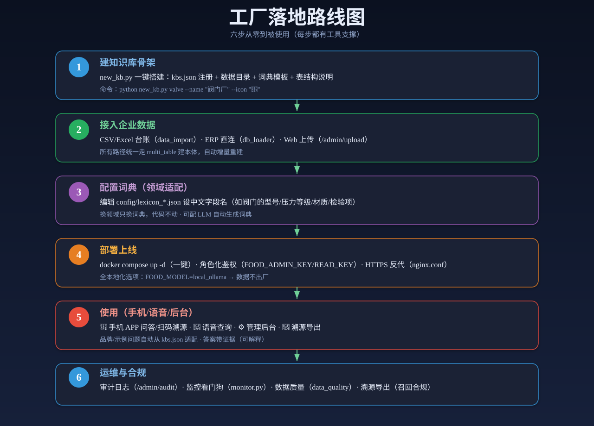

# factory-ontology

工厂本体驱动的数据问答框架。本体建模到自然语言问答的开源实现。CSV 进，答案出，每个答案都带证据。

[](CHANGELOG.md)
[](LICENSE)
[](https://www.python.org/)
[](https://github.com/zhengjinjun1975/factory-ontology/actions)

大模型很聪明，但它不认识你的数据表。把台账直接丢给 LLM，它编起数字来理直气壮。这个仓库的做法很朴素：先让数据自己说话，再让模型在数据划定的圈子里回答。本体就是这个圈子。

## 它解决什么问题

工厂现场常见的三个场景：

| 场景 | 现状 | 代价 |
|------|------|------|
| 数据看不懂 | MES/SCADA/台账数据躺在系统里，业务和运维人员不会 SQL | 决策靠老师傅拍脑袋 |
| 信息难找 | 查"哪台设备要维护"要翻系统、等 IT 排期 | 响应慢，活等人 |
| 知识断层 | 老师傅退休带走经验，新人对着字段名猜含义 | 经验流失 |

这个框架把结构化数据变成可以自然语言提问的问答系统。业务人员问"报警的空压机有几台"，系统回答，并给出依据。回答不靠模型猜，靠本体里的确定性计算。

## 思路：本体是受限的 schema

核心路径一句话：**CSV/结构化数据 → 本体建模（schema 驱动）→ 自然语言问答 + 溯源 + GraphRAG 检索**。

本体在这里不是 W3C 的完整 OWL 推理体系，而是一份轻量的 JSON schema。它声明三类东西：实体（有哪些表、哪些类）、关系（表与表怎么关联）、属性角色（哪个字段是编号、哪个是数值、哪个是分类）。schema 驱动建模把多张表统一成一张"实体-关系-属性"图，输出标准 N-Triples，下游的规则引擎和 GraphRAG 消费同一份产物。

轻，所以快。换一个工厂，换一份 schema 和词典，代码不动。

**诚实定位**：适用场景是中小工厂、台账级结构化数据（单表或多表 CSV）。不是通用 AI 平台，不是大规模图数据库方案，不处理非结构化文本。本体是受限 schema，回答能力限定在结构化查询模板之内。这部分能力边界写在第 [诚实边界](#诚实边界) 节。

## 与主流路线的区别

| 路线 | 做法 | 短板 |
|------|------|------|
| Text-to-SQL | 让 LLM 直接生成 SQL | 公开基准上报告的 SOTA 准确率约为 Spider 87%、BIRD 63%，再往上靠针对具体库的适配。表结构一变，生成就要重来。还要防它生成写库语句 |
| 向量 RAG | 语义相似度检索 + LLM 生成 | 答案流畅，但来源不可控，幻觉难根除。追问"为什么是这个数"，答不上来 |
| 本体规则引擎 | 本体约束 + 确定性计算 + 证据溯源 | 查询被限定在结构化模板内，开放式问题仍需 LLM 兜底 |

本方案取的是第三条路。本体把表变成受限 schema，规则引擎在 schema 内确定性回答：数量、极值、平均、过滤、范围、计数。答案精确、可复现、零 token。规则覆盖不到的开放式问题，降级到本体引导的 GraphRAG 和 LLM。代价明确：不写 SQL 换来的确定性，边界就是模板本身。

## 快速开始

```bash
cd codes

# 1. 用公开示例数据集建模（UCI AI4I 预测性维护数据集，1 万行真实制造传感器数据）
python run.py setup data/ai4i.csv ai4i

# 2. 自检全流程
python run.py test

# 3. 自然语言问答（以下为 ai4i 实测输出）
python run.py ask "一共有多少条记录"      # 一共有 10000 条记录
python run.py ask "机器故障标签=1 的数量"  # 机器故障=1 的数量是 339
python run.py ask "扭矩的最大值"          # 最大扭矩的记录: 7764 (扭矩=76.6)
```

### 换你自己的数据

三步，不写代码：

```bash
# 1. 单表：CSV → 本体
python csv_to_owl.py 你的数据.csv output/你的数据.nt

# 2. 自动词典：LLM 推断字段语义，生成中文词典
python run.py setup 你的数据.csv

# 3. 直接问：规则引擎（ontology_qa_v3）回答
python run.py ask "你的问题"
```

多表场景走 schema 驱动统一建模：

```bash
# 多表数据目录 + ontology_schema.json → 统一本体（约束校验 + 类型体系 + 语义域）
python run.py setup-schema data_valve config/ontology_schema.json valve
```

没有手写 schema 时，`suggest_schema` 从数据自动推断实体、关系和约束，无 schema 也能建模。

### 多数据源

`data_loader.py` 统一读取 CSV / JSON / SQLite / Excel：

```bash
python csv_to_owl.py data/equipment.json output/equipment.nt   # JSON
python csv_to_owl.py data/equipment.db  output/equipment.nt    # SQLite（取第一个表）
python csv_to_owl.py data/equipment.xlsx output/equipment.nt   # Excel（需 pip install openpyxl）
```

CSV / JSON / SQLite 用标准库实现，零第三方依赖。

## 核心概念

| 概念 | 说明 |
|------|------|
| **schema 驱动建模** | `schema_ontology.py`：schema 显式声明实体/关系/约束；属性语义角色（identifier/reference/measure/category/timestamp）；类型体系（Enterprise → BusinessObject → 域类 → 实体）；validate 约束校验；traverse 跨域图遍历；build_graph 跨表统一实例图；to_nt 输出标准 N-Triples |
| **词典驱动** | 字段中文名、枚举值、状态词全部外置在 lexicon JSON。问答逻辑不绑定具体词表，换领域只换词典 |
| **规则引擎** | `ontology_qa_v3.py`：数量/极值/平均/总和/范围/过滤计数/反查/分组/列出/TopN 等通用模板，确定性执行，零 token |
| **本体引导 GraphRAG** | `graph_rag.py`：规则 miss 后，问题匹配本体关系时沿关系路径扩展种子（find_seeds），子图检索 + LLM 生成 |
| **检索容错** | 材质/单位/类型同义词扩展。问"不锈钢"能命中 CF8/CF8M/304/1Cr18Ni9Ti 等牌号 |
| **证据溯源** | `/api/ask` 返回 evidence：命中实体、属性、数值，前端逐条展示"为什么是这个答案" |

## 架构

```
data_loader → schema_ontology（schema 驱动统一建模 + suggest_schema 自动推断）
            → ontology_qa_v3（规则引擎，确定性优先）
            + graph_rag（本体引导 GraphRAG 兜底）
            → api_server（REST API）+ web（Svelte5 前端）
```

分层：交付层（Web/APP/语音/管理后台）→ API 层（FastAPI）→ 问答推理层（规则 → 逻辑桥 → GraphRAG，确定性优先）→ 本体层（本体图 + 词典外置）→ 数据层（多格式）→ 模型层（云端 DeepSeek / 本地 Ollama 可切换）。

### 核心组件

| 模块 | 作用 |
|------|------|
| `data_loader.py` | 统一读取 CSV/JSON/SQLite/Excel |
| `schema_ontology.py` | schema 驱动统一建模：属性语义角色、类型体系、validate/traverse/build_graph、suggest_schema 自动推断、to_nt |
| `ontology_qa_v3.py` | 规则问答引擎（词典驱动，确定性，零 token） |
| `graph_rag.py` | 本体引导 GraphRAG：建图、同义词扩展、种子定位、子图检索、LLM 生成 |
| `api_server.py` | REST API：问答、正/反向溯源、扫码、统计、管理 |
| `web/` | Svelte5 前端：CSV 上传 → 建模 → 问答 → 证据溯源 → 知识图谱/分析看板 |

周边能力（2.x 时代沉淀，保留可用）：`csv_to_owl.py`/`multi_table.py`（无 schema 的单表/多表建本体兼容路径）、`logical_qa.py`（逻辑桥：LLM 转逻辑查询后确定性执行）、`bm25_retrieval.py`（BM25 稀疏检索，零依赖）、`evidence.py`（证据提取）、`graph_store.py`（SQLite 图持久化）、`mcp_server.py`（MCP server，AI agent 可调用）、`voice_assistant.py`（语音助手）、`data_import.py`/`data_quality.py`/`monitor.py`（数据接入/质量校验/看门狗）、`new_kb.py`（新知识库骨架）、`agents/lexicon_agent.py`（自动词典生成）、`config/`（模型配置 + 词典 + schema + 多租户注册表）。

### 架构图




## 示例

### UCI AI4I 预测性维护（公开数据集）

1 万行真实制造设备传感器数据，14 列。自动建模时间约 2 分钟，12 个属性中文名自动生成。覆盖数量/极值/范围/统计/组合/过滤计数全类型提问。

### 阀门厂（合成示例数据）

`data_valve/` 为虚构数据，但字段特征取自真实行业标准：GB/T 32808 阀门型号编码（Z41H-16C、Q641F-40P）、材料牌号（WCB/CF8/CF8M/304）、API 598 试压矩阵（壳体/密封压力、保压、泄漏率气泡/min）、设备传感器（振动/温度/电流）。用于演示"换领域即用"和检索容错。多表 schema 建模实测：8 张表 → 1066 行 N-Triples（142 节点 / 173 边）。

```bash
cd codes
python valve_demo.py
```

实测输出（v0.1.4，规则部分确定性可复现）：

```
规则问答:  一共有多少个阀门 → 一共有 8 条记录
          价格最贵的阀门 → 最大价格的记录: 对夹蝶阀 D371X-10（价格=2560.0）
逻辑桥:    有多少种球阀 → 符合条件的有 2 条
反向溯源:  不合格原料 R007螺栓 → 受影响批次 → 产品（召回场景成立）
benchmark: 9/9 = 100%
```

同义词容错实测：问"不锈钢"，检索命中 CF8 产品 P004/P003 及多批含 304/CF8 牌号的原材料。

### 食品溯源（合成示例数据）

`data/food_*.csv` 为虚构数据，演示正/反向溯源：原料 → 批次 → 产品，质量召回场景。

## REST API

```bash
cd codes && pip install fastapi uvicorn
python api_server.py          # http://localhost:8000
```

| 端点 | 说明 |
|------|------|
| `POST /api/ask` | 自然语言问答（规则引擎 → 逻辑桥 → GraphRAG → BM25） |
| `GET /api/trace/forward?batch=B001` | 正向溯源：批次 → 产品 + 原料 |
| `GET /api/trace/reverse?raw=R007` | 反向溯源：原料 → 受影响批次 → 产品 |
| `GET /api/scan?code=***` | 扫码溯源 |
| `GET /api/stats` | 知识库统计 |
| `POST /api/admin/rebuild` | 接新数据后强制重建本体（需 admin Key） |
| `GET /api/admin/audit` | 审计日志查询 |
| `GET /metrics` | 请求计数指标 |

工程化能力：角色化鉴权（`FOOD_ADMIN_KEY`/`FOOD_READ_KEY`，不设则内网开放）、增量重建（数据 hash 检测，变了才重建）、多租户隔离（`config/kbs.json`）、Docker 一条命令部署（`docker compose up -d`）、结构化日志。

## Web 前端

`web/` 是 Svelte5 + Vite 的完整应用，浅色工业风。CSV 上传 → 本体建模 → 自然语言问答 → 知识图谱结构图 → 分析看板，全流程可视化。前端展示证据溯源（答案为什么是这个数）、结构化答案、迷你 KPI 卡片、诊断式看板，logo 区显示代码版本。

```bash
cd web
npm install
npm run build
npm start            # http://localhost:3001
```

## 实测数据

以下数字均为仓库内 benchmark 实测（标准答案从源数据用确定性逻辑计算，不手写）：

| 领域 | 数据集 | 规模 | 评测问题 | 本体命中率 |
|------|--------|------|----------|-----------|
| 制造业（预测性维护） | UCI AI4I（公开） | 10,000 行 | 61 | **61/61 = 100%** |
| 图书库存 | library_inventory（合成） | 10 行 | 13 | **13/13 = 100%** |
| 能源电站设备 | energy_station（合成） | 10 行 | 13 | **13/13 = 100%** |
| 食品企业 | food_products（合成） | 8 产品 | 9 | **9/9 = 100%** |
| 阀门厂 | valve_products（合成） | 8 产品 | 9 | **9/9 = 100%** |

对照：裸 LLM（不加本体、直接把数据喂给模型）同批问题命中 7/9 = 78%，差的恰好是计算类（平均值、总和），详见 [方法论文-本体vs裸LLM](docs/方法论文-本体vs裸LLM.md)。

其他验证：GraphRAG 开放式问题 8/8；同义词容错 8/8；20 万实体 SQLite 图持久化实测（写入 1.58s / 加载 1.76s / 67MB）；pytest 29 项全过（CI 自动运行）。

复现：

```bash
cd codes
python csv_to_owl.py data/ai4i.csv output/ai4i.nt
python benchmark.py data/ai4i.csv
python csv_to_owl.py data/library_inventory.csv output/library_inventory.nt
python benchmark.py data/library_inventory.csv
python csv_to_owl.py data/energy_station.csv output/energy_station.nt
python benchmark.py data/energy_station.csv
python csv_to_owl.py data/food_products.csv output/food_products.nt
python benchmark.py data/food_products.csv
python valve_demo.py
```

## 模型配置

`codes/config/model_config.json` 统一管理，`active` 切换：

```json
{
  "active": "cloud",
  "models": {
    "local": { "type": "ollama", "base_url": "http://127.0.0.1:11434/api/generate", "model": "ornith:latest", "api_key": "" },
    "cloud": { "type": "openai", "base_url": "https://api.deepseek.com/v1/chat/completions", "model": "deepseek-chat", "api_key": "" }
  }
}
```

规则能答的走规则（省 token、快、准、可复现），规则未命中才走 LLM。本地 Ollama 可全离线运行，数据不出厂。

## 设计原则

1. **建模是桥不是终点**：让模型懂领域，别为建模而建模
2. **规则兜底 + LLM 泛化**：确定性走规则，模糊走 LLM
3. **泛化靠外置**：词典、schema、字段映射全是配置，换领域只换配置
4. **单一职责**：每个模块只做一件事，可替换
5. **零依赖可部署**：核心路径纯标准库，能带到任何现场

## 文档

- [方法论文-本体vs裸LLM](docs/方法论文-本体vs裸LLM.md)：实证论文，本体规则引擎 100% vs 裸 LLM 78%（+22pp）
- [泛化方法论](docs/泛化方法论.md)：schema 驱动建模 + 本体驱动混合检索 + 本体约束，多领域 benchmark 实证
- [交付方法论](docs/交付方法论.md) / [交付白皮书](docs/交付白皮书.md)：现场落地方法
- [部署](docs/部署.md)：小型企业部署指南（API + APP + 语音）
- [开源调研](docs/开源调研.md)：本体/知识图谱开源生态调研
- [合规](docs/合规.md)：溯源合规与召回场景

## 贡献指南

欢迎提 issue 和 PR。

- **Bug 报告**：附复现命令（数据文件 + 问题 + 期望/实际输出）
- **PR 要求**：代码 + 对应测试；跑通 `python -m pytest tests`；涉及问答能力的改动，附 benchmark 复现结果
- **示例数据一律用虚构数据**：仓库不接收任何真实工厂数据
- **保持词典驱动**：不要在规则引擎里硬编码具体中文词，字段语义走 lexicon
- 提问模板类改动，先看 `ontology_qa_v3.py` 的模板顺序注释，避免同类劫持回归

## 版本更新记录

v0.1.x 是当前版本线（schema 驱动重构后的新基线）；2.9.x 及更早为重构前的能力演进，多数能力（REST API、溯源、多租户、图存储、逻辑桥、语音、MCP）保留在代码中。完整变更见 [CHANGELOG.md](CHANGELOG.md)。

| 版本 | 内容 |
|------|------|
| **v0.1.4** | 厂区数据真实化（GB/T 32808 型号编码、材料牌号、API 598 试压矩阵）+ 检索容错（同义词扩展，问"不锈钢"命中 CF8/304） |
| **v0.1.3** | 安全加固：建模失败报告、SQL 注入白名单、编码正确性 |
| **v0.1.2** | 本体驱动增强：本体引导 GraphRAG 种子、本体约束减幻觉、suggest_schema 自动推断 |
| **v0.1.1** | schema 驱动统一建模（重构新基线，融入 sme 本体重构精髓：属性语义角色/类型体系/validate/traverse/build_graph/to_nt） |

## 诚实边界

- **能力边界**：规则引擎覆盖结构化查询（数量/极值/平均/过滤/范围/计数）；开放式/关系/模糊问题走 GraphRAG 或 LLM 兜底，命中率不保证
- **本体定位**：轻量 JSON schema，非 W3C OWL 推理本体。输出 N-Triples 仅为标准序列化，不涉及推理机
- **数据形态**：最适配结构化台账（单表/多表 CSV）；不处理非结构化文本，无大规模语义检索（种子定位是子串匹配 + 同义词扩展）
- **规模**：内存图为主，台账级；20 万实体可用 SQLite 图持久化过渡，不适合百万级实体图
- **词典校对**：自动词典偶有误判，关键字段需人工确认
- **LLM 稳定性**：本地小模型偶发空响应，生产建议用更强模型
- **工程化程度**：有 CI / pytest / Docker 基础部署，无分布式，无大规模生产部署故事。它是可复现的方法论实现，不是开箱即用的生产平台

## License

[Apache License 2.0](LICENSE)
